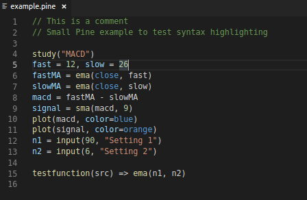

# Pine script syntax highlighting for VS Code

## Features

This extension adds Pine Script Syntax Hightlighting for VS Code

## Pull requests

If you find the syntax highlighting to be inadequate, please submit a PR.

#### Share

Do share good strategies or inidcators.

Note: This extension is provided as-is. It doesn't do tricks for your trading. Only colors what you write...

### Icon

Icon is tree from Fontawesome 5 Free (https://fontawesome.com/), as the Pinescript language does not have an official icon. Icon is © Fonticons Inc

